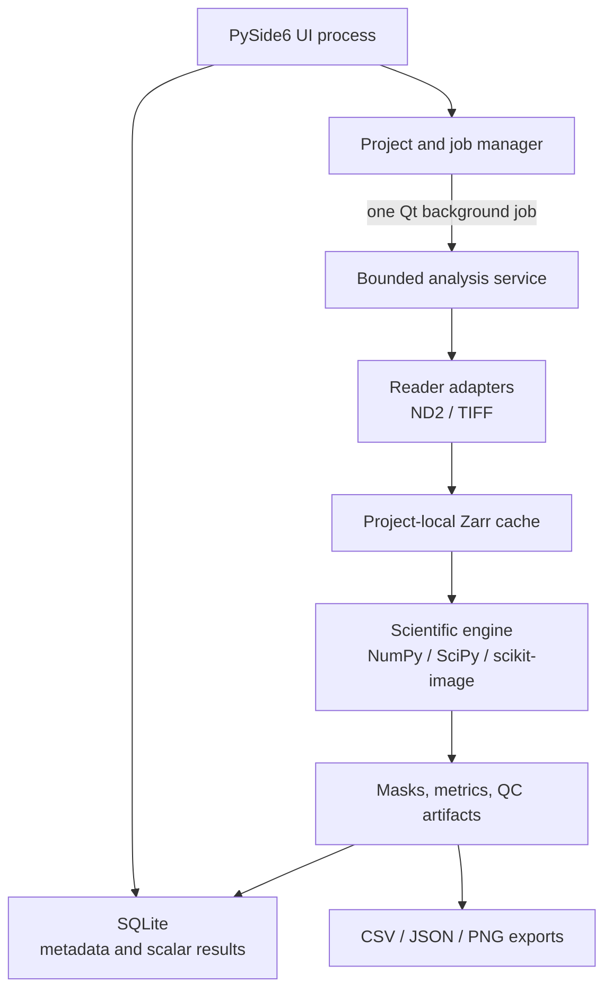

# Plan v2 — Local Desktop Plug Quantification Prototype

**Date:** 14 August 2026  
**Status:** Approved and implemented as the version-0.2.2 candidate prototype; manual acceptance gates remain  
**Working name:** Plug Analyzer  
**Primary targets:** Apple Silicon macOS and Windows x64

Evidence and technical sources are listed in [Research and Technical References](RESEARCH_REFERENCES.md).

## 1. Outcome

Build a small, installable desktop application that opens a microscope Z-stack, lets an SME review the channel/plug geometry, calculates a locked set of deterministic measurements, shows the evidence behind every result, and saves selected analyses locally for comparison across samples.

The prototype is a measurement-validation tool, not yet a clinical or product-efficacy system. It must be fast to develop, simple for an SME to use, scientifically auditable, and safe with files larger than RAM.

```mermaid
flowchart LR
    A["ND2 or TIFF source<br/>read-only"] --> B["Import preflight<br/>axes, metadata, RAM, disk"]
    B --> C["Lossless local Zarr cache<br/>all selected voxels"]
    C --> D["SME geometry review<br/>lumen, axis, junction, ROIs"]
    D --> E["Locked deterministic<br/>3D analysis"]
    E --> F["Mask overlays, metrics,<br/>QC and robustness"]
    F --> G["Explicit Save<br/>SQLite + Zarr + CSV"]
    G --> H["Compare saved<br/>app runs"]
```



### What changed from the first draft

- Added direct Nikon ND2 support instead of assuming TIFF will always be exported.
- Kept a small reader-adapter design so another genuine vendor format can be added without redesigning the app.
- Simplified execution to one bounded background job with cooperative cancellation—no service, process pool, or distributed system.
- Made RAM/disk preflight, lossless all-voxel processing, cancellation, and recovery explicit acceptance requirements.
- Kept external human-reference validation outside the app and retained comparison between saved app runs.
- Put all scientific data beneath a visible user-chosen project folder and removed authentication completely.
- Limited release targets to Apple Silicon macOS and Windows x64 installers.
- Strengthened the scientific method with native metadata checks, pre-contact subtraction when available, background-referenced 3D segmentation, boundary censoring, robustness reporting, and agreement—not correlation alone—for validation.

## 2. Scope boundaries

### Included in v1

- One local user on one computer; no sign-in.
- A user-chosen visible project folder.
- Nikon ND2 plus TIFF, ImageJ TIFF, OME-TIFF, multipage TIFF, and BigTIFF.
- Selection of one scene/position, time point, and fluorescence channel for one analysis run.
- Lossless import, large-file preflight, adaptive chunking, progress, cancellation, and safe resume.
- XY viewer with Z slider, XZ/YZ views, raw/mask overlay, display controls, and geometry/ROI tools.
- Requested metrics: plug area per Z-plane, corrected integrated intensity per Z-plane, and apparent low-fluorescence fraction.
- Additional clogging-relevant metrics: observed 3D volume, mean fluorescence, penetration, cross-sectional occlusion, remaining open area, connected open path, path bottleneck clearance, and QC diagnostics.
- Saved runs, side-by-side app-run comparison, and CSV/JSON/PNG export.
- Reproducible protocol/parameter versioning and result provenance.
- Apple Silicon macOS `.dmg` and Windows x64 installer `.exe`.

### Deliberately excluded from v1

- Cloud services, database servers, accounts, roles, telemetry, or collaboration features.
- App Store or Microsoft Store publication.
- Intel Mac or universal Mac binaries.
- Machine learning.
- Automatic ingestion of arbitrary SME spreadsheets.
- Universal support for every microscope vendor format before real examples are supplied.
- A claim of true physical porosity from one fluorescence channel.
- A claim of functional sweat blocking without flow, pressure, or hydraulic-resistance evidence.
- Simultaneous editing of the same project by multiple application instances.

## 3. Source-file strategy

### 3.1 Is TIFF necessarily an export?

Not necessarily. Nikon software can save acquired images as TIFF or ND2. However, ND2 is Nikon NIS-Elements' native multidimensional container and is the most likely untouched source from a Nikon AX acquisition. The current TIFF contains ImageJ-style metadata, so it may have been exported or resaved, but that is only an inference until the untouched acquisition file is supplied.

The Phase 0 request to the SME is:

> Please provide the untouched file saved directly by NIS-Elements, without opening or exporting it through ImageJ, plus the matching NIS-Elements image-properties report if available.

### 3.2 v1 format matrix

| Input | v1 decision | Reader |
|---|---|---|
| Modern Nikon `.nd2` | First-class | `nd2` |
| Legacy/JPEG2000 Nikon `.nd2` | First-class after a real test file | `nd2[legacy]` + `imagecodecs` |
| TIFF / multipage TIFF / ImageJ TIFF | First-class | `tifffile` + `imagecodecs` |
| OME-TIFF / BigTIFF | First-class | `tifffile` + `imagecodecs` |
| Internal Zarr cache | Internal only in v1 | `zarr` |
| Other vendor formats | Add one adapter only after receiving genuine samples | Deferred |
| JPEG/PNG/GIF | Preview only or reject for quantitative work | Not a scientific input |

Bio-Formats will not be bundled in v1. It is broad and valuable, but Java, distribution size, diagnostics, and licensing make it unnecessary complexity when the immediate need is Nikon ND2 plus TIFF. It can be reconsidered as an isolated importer if real future samples require several additional vendor formats.

### 3.3 Reader contract

Each reader adapter must:

1. Probe file contents rather than trust only the filename extension.
2. Return canonical axes such as `S,T,C,Z,Y,X`, dtype, significant bits, and all series/scene sizes.
3. Offer lazy region/chunk reads; never require full-file loading.
4. Return normalized metadata and preserve untouched vendor metadata.
5. Never apply a LUT, contrast stretch, rescale, lossy conversion, or 8-bit conversion.
6. Keep the source read-only.

If multiple scenes, channels, Z-stacks, or time points exist, the import screen must show them and require a selection. The app must never silently flatten, merge, or discard a dimension.

ND2 support is provisional until it passes genuine laboratory-file acceptance tests. An unsupported, truncated, or ambiguous ND2 file fails closed and produces a copyable compatibility report; it is never silently reinterpreted. The fallback SOP is for the SME to export that source from NIS-Elements as OME-TIFF, or as a lossless original-bit-depth TIFF plus acquisition-property report when OME-TIFF is unavailable.

Calibration precedence is: native structured metadata, then OME metadata, then ImageJ metadata, then explicit manual entry. Every value records its source. If two sources materially disagree, the app shows both and requires a reviewed choice rather than silently applying precedence. Missing or ambiguous calibration produces a visible warning and blocks physical-unit metrics until resolved.

## 4. Architecture and technology



The UI and scientific engine are separate modules, and the engine is also callable from the command line for automated tests and reproducibility. Version 0.2.2 uses one in-process Qt background job because arrays remain local and the packaging is simpler. Cooperative cancellation, project-generation guards, and visible work directories protect application state; native-crash isolation is outside this prototype architecture.

### 4.1 Final stack

| Concern | Choice | Reason |
|---|---|---|
| Language | Python 3.12 | Strong scientific ecosystem and fast prototype iteration |
| Desktop UI | PySide6, Qt Widgets | Native cross-platform application and official deployment path |
| Image/charts/ROI | PyQtGraph | Fast array display, linked plots, and interactive ROIs |
| Nikon input | `nd2[legacy]` | Pure-Python ND2 reader, metadata access, lazy Dask support |
| TIFF input | `tifffile` + `imagecodecs` | TIFF, ImageJ, OME-TIFF, BigTIFF, compression support |
| Image math | NumPy, SciPy, scikit-image | Deterministic, tested image processing |
| Out-of-core arrays | Zarr v3 + Dask Array | Chunked local storage and bounded computations |
| Scheduling | Local threaded scheduler only | No distributed system or cluster |
| Resource checks | `psutil` | Cross-platform available RAM, process memory, CPU, and disk |
| Local metadata | SQLite | One portable file, no server |
| Config validation | Pydantic | Versioned, validated protocol and run manifests |
| Testing | pytest | Unit, integration, numerical, and recovery tests |
| Packaging | `pyside6-deploy` / Nuitka standalone | Bundled app with no end-user Python installation |
| Installers | DMG on macOS; Inno Setup `Setup.exe` on Windows | One artifact per platform for internal distribution |

Dask remains an internal implementation detail. Simple reductions may use an explicit bounded chunk iterator when that is clearer. `dask.distributed`, a process pool, and nested BLAS/OpenMP threading are not part of v1.

## 5. Large-file design

### 5.1 Non-negotiable rule

Every selected source voxel is decoded and processed. Downsampled multiscale data is allowed only for interactive display. It is never used for scientific measurements.

### 5.2 Import preflight

The app reads metadata first and calculates decoded size before decoding pixels:

\[
N = \prod(\text{selected dimension lengths}) \times \text{dtype bytes}
\]

The preflight card shows:

- source format, selected dimensions, dtype, significant bits, and decoded size;
- available RAM, free project-disk space, planned chunk size, and planned thread count;
- estimated worst-case project growth;
- calibration, saturation, incomplete-volume, and metadata-comparability warnings.

Disk planning does not assume compression savings. It calculates the peak occupancy of every stage, not only the final project size:

\[
H_s = \text{persistent artifacts at stage }s + \text{stage scratch} + \text{atomic-finalization reserve}
\]

\[
\text{required free} = 1.20 \times \max_s(H_s) + 2\,\text{GiB}
\]

The artifact inventory includes the worst-case uncompressed source cache, persisted masks, previews, optional source copy, partial/resumable output, temporary binary masks, full-volume label/distance arrays when a stage cannot stream them, metrics, logs, and any second copy needed before an atomic finalize. Sequential robustness variants reuse scratch space and do not retain a full mask per variant. Phase 2 measures and versions the real disk high-water factor for every algorithm stage, just as it does for RAM. Processing stops safely before the free-space reserve is crossed.

The user can choose whether the original vendor file is also copied into the project. The normalized cache always stores the selected pixels losslessly at the original dtype.

### 5.3 Adaptive RAM plan

Use `psutil.virtual_memory().available`, not `total - used`.

At job start:

\[
R = \max(2\,\text{GiB}, 0.20 \times \text{physical RAM})
\]

\[
B = \min(0.60 \times \text{available RAM},\; \max(0, \text{available RAM}-R))
\]

Do not start when `B < 1 GiB`; ask the user to close other applications or choose a machine with more memory.

Initial operating limits:

- one analysis job at a time;
- at most four compute threads and at least one CPU core left for the OS/UI;
- Zarr storage chunks around 4–16 MiB uncompressed, normally shallow in Z;
- compute chunks around 32–256 MiB, aligned to whole storage chunks;
- stage-specific memory-amplification factors measured and versioned during Phase 2;
- RAM and worker RSS rechecked before every chunk batch;
- concurrency reduced or scheduling paused when free memory becomes unsafe.

No plane, pixel, or data point is skipped to satisfy memory limits. If a safe minimum chunk cannot run, the job pauses with a clear explanation.

### 5.4 Chunk correctness

- Filters and morphology use physical-unit halos, trimmed before output is written.
- Connected components are reconciled across chunk faces with deterministic label merging.
- Global inlet-to-outlet connectivity is computed from the complete chunk-boundary graph.
- Chunked results must equal the in-memory result on smaller fixtures within an explicitly defined numerical tolerance; binary masks must be identical.
- Float reductions use stable `float64` accumulation to avoid integer overflow and reduce order-dependent error.

### 5.5 Cancellation and recovery

Each running job writes only under `work/<job-id>/` with a manifest, partial arrays, completed-chunk IDs, and checksums. Completion is published only after all expected chunks are verified and the result metadata is committed in one SQLite transaction.

- Cancel is checked between chunks or small batches.
- Graceful cancellation retains a resumable draft and offers Resume or Delete.
- If cooperative cancellation cannot interrupt a native-library call immediately, the operator may close/restart the app; incomplete work remains visible and cannot be finalized as a saved run.
- Resume is permitted only when source hash, selected series, app/protocol version, parameters, and chunk plan still match.
- A cancelled or failed job never appears as a saved scientific result.

## 6. Scientific analysis

The full candidate protocol is in [SCIENTIFIC_METHOD_V1.md](SCIENTIFIC_METHOD_V1.md). The important product rules are:

1. Analyze original intensity values; display contrast never changes data.
2. Confirm label identity, voxel calibration, acquisition settings, saturation, and volume coverage.
3. Use a user-reviewed lumen, channel axis, junction, analysis range, and background/reference region.
4. Prefer registered pre-contact subtraction when a matching pre-stack exists; otherwise use a documented robust background model.
5. Create the plug mask from a lightly filtered analysis copy, but calculate fluorescence from corrected raw values.
6. Use one locked background-referenced 3D segmentation rule across a validation batch; never independently auto-threshold every Z-plane.
7. Keep holes and possible open passages; do not fill them by default.
8. Save the protocol and algorithm version with every run.
9. Report a fast threshold-sensitivity band on standard saved runs; use extended robustness for locked validation runs.
10. Disable or qualify metrics when the structure touches an image boundary or the full lumen is not captured.

### 6.1 Result set

| Result | v1 status | Important qualification |
|---|---|---|
| Plug area by Z-plane | Primary | Requires valid XY calibration for µm² |
| Corrected summed pixel intensity by Z-plane | Primary | ImageJ-style sum; sampling, settings, and chemistry must be comparable |
| Area-/volume-weighted fluorescence integrals | Diagnostic | Spatial numerical integrals, not calibrated material amount |
| Mean corrected plug intensity | Primary diagnostic | Separate from area and integrated intensity |
| Observed 3D plug volume | Primary | “Within imaged volume” if any extent is incomplete |
| Maximum and robust `q95` penetration | Primary | Lower bound if the plug touches the field boundary |
| Cross-sectional occlusion curve | Primary clogging indicator | Requires a valid full-lumen mask |
| Remaining open-area curve | Primary clogging indicator | Same full-lumen requirement |
| Connected image-resolved open path | Primary clogging indicator | Not equivalent to measured flow |
| Open-path bottleneck clearance | Primary diagnostic | Sub-resolution passages are unreliable |
| Apparent low-fluorescence fraction | Experimental | Not true physical porosity; requires a reviewed envelope |
| Wall-associated plug fraction | Diagnostic | Supports assessment of wall-first growth |
| Largest-component fraction | QC diagnostic | Flags fragmented/noisy segmentation |
| Saturated-pixel fraction | QC diagnostic | Saturated intensity is a lower bound |

The software should be willing to say “not available” or “lower bound.” That is preferable to a precise-looking number unsupported by the captured volume.

## 7. Application screens

### A. Home and projects

- Create/Open Project; recent projects.
- Visible project path and total storage size.
- Samples table with status, group, date, source format, warnings, and saved-run count.
- No user/account screen.

### B. Import and preflight

- Detect source reader, scenes/positions, channels, time points, and Z range.
- Show metadata and let the user select exactly one analysis volume.
- Show decoded size, disk/RAM plan, and warnings before Start Import.
- Allow missing calibration to be entered manually with a permanent “manual” provenance tag.

### C. Review and analyze

- XY image with Z slider plus linked XZ/YZ views.
- Raw, corrected, mask, and disagreement/uncertainty overlays.
- Independent display brightness/contrast controls.
- Tools for analysis/lumen, background, and plug-envelope rectangles or editable polygons, with erase and undo/redo. Connectivity terminals use the documented straight cardinal-X channel assumption.
- Protocol summary, threshold preview, sensitivity preview, progress, cancel, and QC checklist.
- The software may propose geometry, but the SME approves it before a run is finalized.

### D. Results

- Summary cards with status/qualification labels.
- Area vs Z, intensity vs Z, occlusion vs duct position, and open-area vs duct position charts.
- Clicking a chart position navigates to the corresponding plane/cross-section.
- Overlay before/after threshold sensitivity.
- Export CSV, JSON, and figures.
- **Save Analysis** creates an immutable run; edits create a new version.

### E. Compare and validate

- Select saved runs and show aligned result tables and overlay curves.
- Group samples as control/formulation/time/concentration through simple optional metadata.
- Copy the result table to the clipboard for use beside an SME's existing spreadsheet.
- Optional “Reference value” fields for manual entry, with unit, reviewer, method, date, tolerance, and note.
- Show estimate, reference, signed error, absolute error, percentage error when meaningful, and pass/fail against the SME tolerance.
- No arbitrary spreadsheet parser in v1.

### F. Storage and privacy

- Show project folder, settings folder, cache size, unfinished-work size, and logs.
- Open each location in Finder/Explorer.
- Clear previews, clear normalized cache, clear unfinished work, or move a project to Trash with an exact deletion preview.
- State explicitly: no cloud upload and no telemetry.

## 8. Validation design

### 8.1 Manual scalar comparison is the v1 path

SMEs may keep their own spreadsheets open separately. The app does not need to understand those formats. It provides readable and copyable app-run results.

Across saved estimate/reference pairs, calculate:

- bias, MAE, and RMSE;
- Bland–Altman mean difference and limits of agreement;
- Lin concordance correlation coefficient;
- percentage error only when the reference is safely non-zero;
- SME-defined pass/fail tolerance.

Correlation alone is not treated as agreement. Z-planes are not counted as independent biological samples.

The prototype uses a conservative UI guard: with fewer than 20 independent paired samples it shows only the paired table, bias, MAE, and RMSE, marked exploratory. At 20 or more it may show Bland–Altman and Lin concordance with bootstrap 95% confidence intervals, but results remain “preliminary” until the Phase 0 statistical plan's required sample size is met. The formal sample size is chosen from the SME's acceptable error/limits-of-agreement width and expected between-sample variability; `n=20` is a display safeguard, not a claim of adequacy. The app checks difference-versus-magnitude plots for heteroscedasticity and uses a predeclared transform or stratification rather than silently applying normal limits of agreement.

### 8.2 Optional spatial ground truth

A reviewed 3D plug mask remains scientifically valuable because scalar agreement can hide an incorrectly located mask, but it is not a blocker. If mask validation is later enabled, it will accept a clearly specified binary mask format and calculate Dice, IoU, precision, recall, volume difference, average symmetric surface distance, and HD95 in physical units.

### 8.3 Method-development discipline

- Development samples: choose and tune the deterministic protocol.
- Locked validation samples: run the frozen protocol without retuning.
- Optional blind test samples: final confirmation.
- Acceptance limits are written by the SME before the locked validation run.
- When multiple experts are available, use a small double-reviewed subset to estimate human variability.

## 9. Local project storage

```text
ProjectName/
  project.sqlite
  sources/<sample-id>/manifest.json
  data/<sample-id>/image.zarr/
  previews/<sample-id>/
  runs/<run-id>/
    mask.zarr/
    metrics.csv
    parameters.json
    qc.json
  exports/
  work/<job-id>/
  logs/
```

Rules:

- The user chooses `ProjectName/`; all scientific data is visible beneath it.
- Store relative internal paths so a complete project folder can be copied between supported macOS and Windows systems.
- Generate case-insensitive-safe identifiers, reject Windows-forbidden characters/reserved names, and enforce a conservative path-length budget.
- A portable project may be copied only after jobs are stopped, SQLite/Zarr stores are cleanly closed, and the project lock is released; provide a “Prepare Project for Copy” check.
- SQLite contains metadata, scalar results, and relative artifact paths—never multi-gigabyte image blobs.
- The worker never writes SQLite; only the UI process commits finalized metadata.
- Use one project lock; a second instance opens read-only or asks the user to close the first.
- Small UI preferences may use the OS-standard application settings folder, but the app shows its location and offers Reset Settings.
- Uninstalling the app does not delete projects.
- Saved runs are immutable. A changed ROI, threshold, protocol, or mask creates a new run.
- Imported caches and work drafts are not scientific results. The UI labels them clearly and allows explicit deletion.

## 10. Packaging and distribution

End users receive an installer, not source code and not a Python environment.

### macOS

- Build an arm64 `.app` on the current Apple Silicon Mac.
- Package the `.app` in a `.dmg`.
- Intel/universal builds are deferred.

### Windows

- Build the standalone application on a Windows x64 machine or local VM; do not cross-build it from macOS.
- Wrap the application directory with Inno Setup into one `Setup.exe`.
- Test on the actual SME Windows version and hardware class.

Use Nuitka standalone mode rather than runtime “onefile” extraction. The recipient still receives one installer artifact, while startup and large scientific dependencies are more predictable.

App Store distribution is unnecessary. Signing is a separate issue: unsigned internal builds may trigger macOS Gatekeeper or Windows SmartScreen. For the earliest pilot, document the one-time trusted-open procedure. Add signing/notarization later if the team wants warning-free distribution.

Every release includes pinned dependencies, third-party notices, an algorithm/protocol version, a small test project, and installer checksums.

## 11. Delivery phases

| Phase | Implementation status | Deliverable and exit gate |
|---|---|---|
| 0. Method/data contract | Candidate complete | SME cleared the prototype direction; scientific parameter/tolerance freeze remains a later validation decision |
| 1. Scientific engine vertical slice | Complete | Supplied TIFF processed headlessly; formulas/synthetic tests and CSV/JSON output pass |
| 2. Native import and large-file core | Complete in software | ND2/TIFF adapters, Zarr ingest, bounded chunks, progress/cancel/resume, and exact equivalence tests; genuine lab-file acceptance remains manual |
| 3. Desktop workflow | Complete | Project/import/review/results UI, linked views, overlays, polygon geometry, explicit saves, exports, and storage lifecycle |
| 4. Comparison | Complete | Saved app-run comparison, plain-language values, and automatic method/calibration/region/channel warnings |
| 5. Packaging and hardening | Code complete | Native recipes, release verifier, dependency smoke, and user guide; each platform's clean-machine execution remains manual acceptance |

One experienced developer should expect:

- a useful vertical slice in roughly two weeks;
- a testable feature-complete prototype in roughly five to six weeks;
- a cross-platform, large-file-hardened pilot in roughly six to eight weeks.

These are planning ranges, not promises. Re-estimate after Phase 0 when genuine ND2 and 5–6 GB files are available.

## 12. Release gates

1. **Math:** synthetic fixtures have analytically known areas, volumes, intensities, occlusion, and connectivity.
2. **Chunk correctness:** in-memory and chunked masks match exactly; scalar results meet defined numerical tolerances.
3. **Import fidelity:** sampled source planes and cached planes are bit-identical; axes/calibration agree with Nikon software.
4. **Reproducibility:** same file, protocol, and app version produce identical masks and scalar values within a declared floating-point tolerance across runs and worker counts.
5. **Scientific QC:** overlays, saturation, boundary censoring, acquisition comparability, and robustness are visible.
6. **Recovery:** cancel, force-stop, disk-full, source-change, and corrupt-cache tests fail safely.
7. **Performance:** genuine 2–6 GB sources complete on the agreed 16 GB reference machine without violating the RAM budget.
8. **Usability:** an SME can import, review, analyze, compare, save, export, and delete without developer help.
9. **Packaging:** clean Apple Silicon and Windows x64 machines install, run, process a sample, and uninstall successfully.
10. **Auditability:** every saved result contains source fingerprint, metadata provenance, geometry version, protocol/algorithm versions, parameters, QC, and timestamps.

## 13. Main risks and controls

| Risk | Control |
|---|---|
| Unknown vendor source format | Support ND2/TIFF now; add adapters only from real samples |
| TIFF export lost acquisition metadata | Prefer untouched ND2; show comparability warnings |
| One stack does not represent future data | Obtain a range of plug strengths and one real large file before method lock |
| Threshold appears precise but is unstable | Locked development/validation split plus robustness interval and overlay review |
| Wall fluorescence is mistaken for plug | Use pre-contact subtraction when possible; explicitly model lumen/wall geometry |
| 5–6 GB compressed file expands far beyond its file size | Preflight from decoded dimensions and worst-case disk usage |
| Chunk seams alter morphology/connectivity | Halos, boundary label merging, and whole-vs-chunk tests |
| Intensity compared across incompatible acquisitions | Store acquisition metadata and warn/block inappropriate comparisons |
| “Porosity” is overinterpreted | Use “apparent low-fluorescence fraction”; require tracer/flow for stronger claims |
| Internal installer is blocked by OS warnings | Document trusted-open flow; add signing later if needed |

## 14. Inputs required for scientific validation and manual acceptance

- 3–5 untouched ND2 files from the actual Nikon AX/NIS-Elements system.
- At least one multi-channel or multi-position example if the lab uses those dimensions.
- One genuine 5–6 GB file.
- Fluorescent label identity and what signal represents.
- Acquisition-property report: voxel calibration, laser, gain/offset, pinhole, objective, averaging, Z order, and saturation range.
- Confirmation that the full plug and complete lumen cross-section are captured.
- A pre-contact/control stack if the experimental protocol can provide it.
- 5–10 representative samples across weak, medium, and strong plug formation.
- Exact Windows version and approximate RAM/CPU of SME laptops.
- SME definitions/tolerances for external scientific validation.
- A predeclared statistical validation target: acceptable bias/error, desired limits-of-agreement precision, and required number of independent samples.

These inputs are not needed to compile or operate the candidate prototype. They are needed to freeze a scientifically validated protocol, exercise genuine vendor/large-file variants, set acceptance tolerances, and support an efficacy claim.
